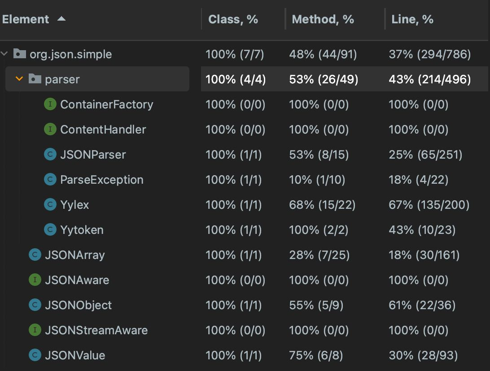
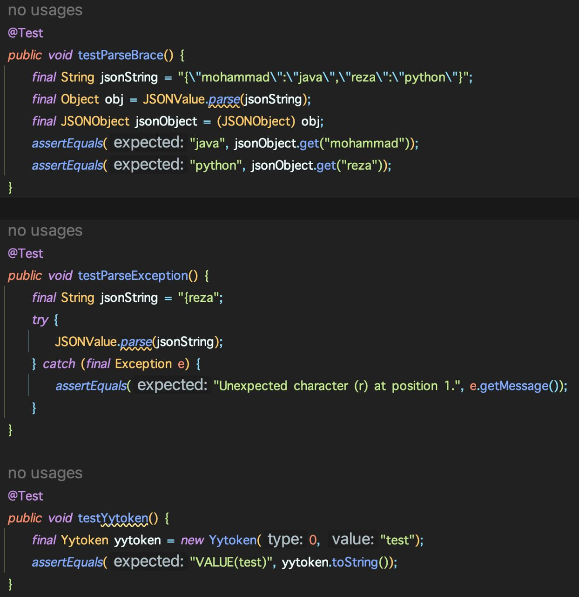
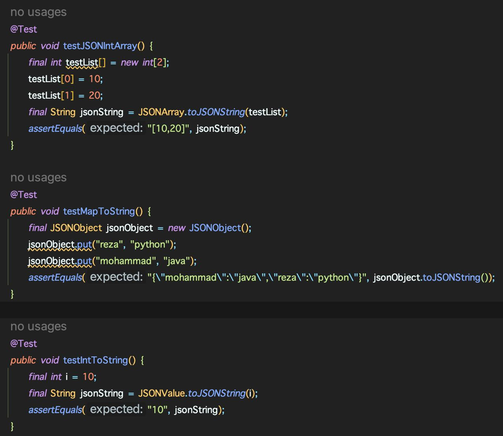
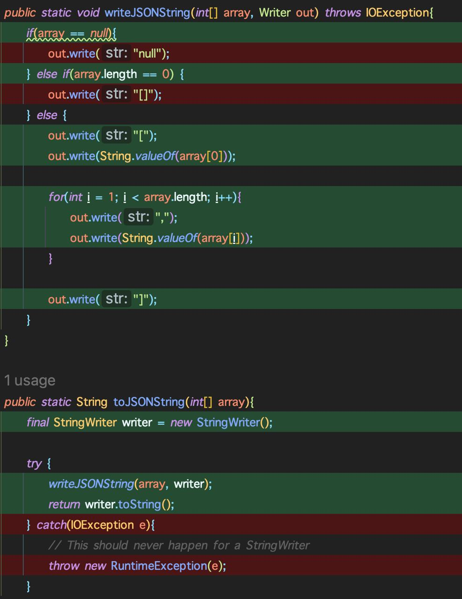
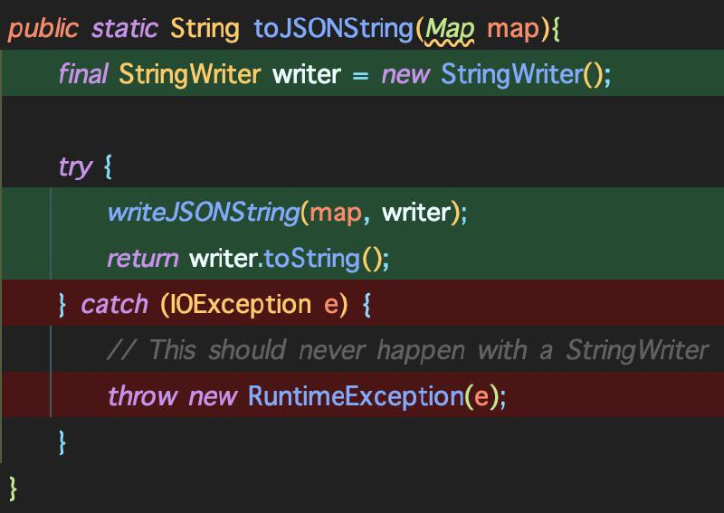
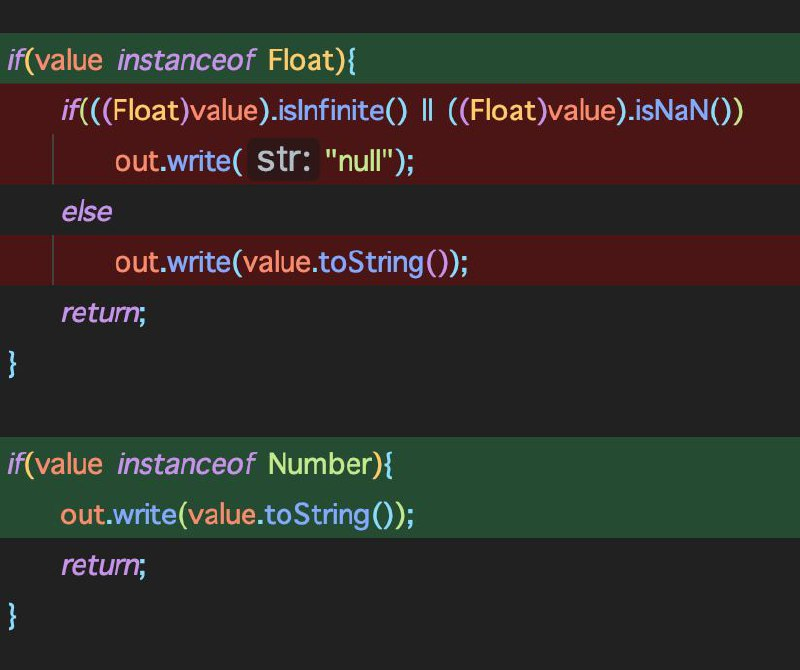
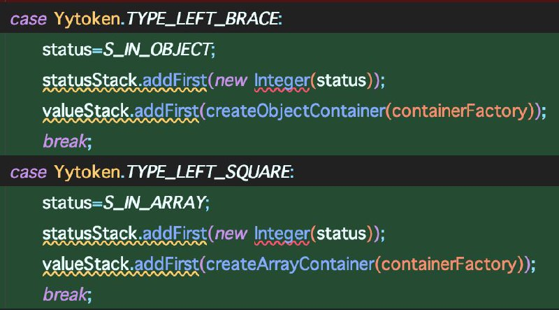
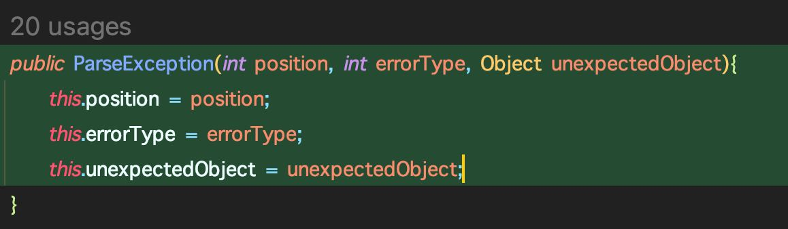
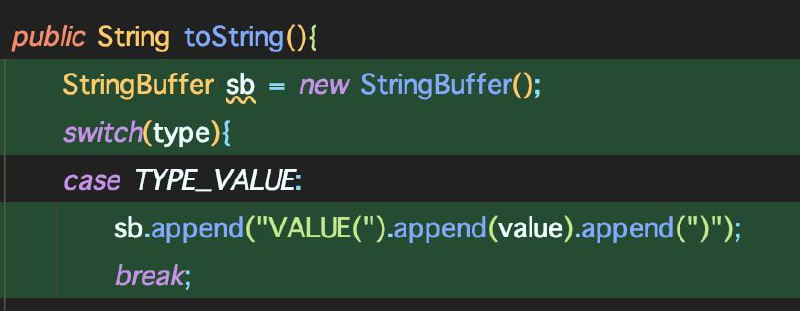

در تصویر زیر میزان پوشش کد در ابتدا مشخص شده است.

در تصویر زیر میزان پوشش کد بعد از نوشتن تست‌های جدید نشان داده شده است.

همانطور که مشخص است میازن پوشش توابع و به دنبال آن خطوط کد به ازای همه‌ی کلاس‌ها افزایش پیدا کرده است.
در ادامه به بررسی هر کلاس و تابع مربوط به آن می‌پردازیم. در ادامه 6 تابع آورده شده است.

تابع testJSONIntArray از کلاس JSONArray تابع toJSONString و به دنبال آن writeJSONString را صدا میزند. بنابراین پوشش کلاس JSONArray افزایش می‌یابد.

تابع testMapToString از کلاس JSONObject تابع toJSONString با ورودی map را صدا می‌زند. بنابراین پوشش آن افزایش می‌یابد.

تابع testIntToString از کلاس JSONValue تابع toJSONString را صدا می‌زند. بنابراین پوشش این کلاس افزایش می‌یابد.

تابع testParseBrace از کلاس JSONParser قسمت‌های زیر که مربوط به پارس براکت هستند را پوشش می‌دهد. در تصویر زیر ای تکه کد مشخص است.

تابع testParseException از کلاس ParseException تابع ParseException را صدا می‌زند.

تابع testYytoken از کلاس Yytoken تابع toString را صدا می‌زند.

